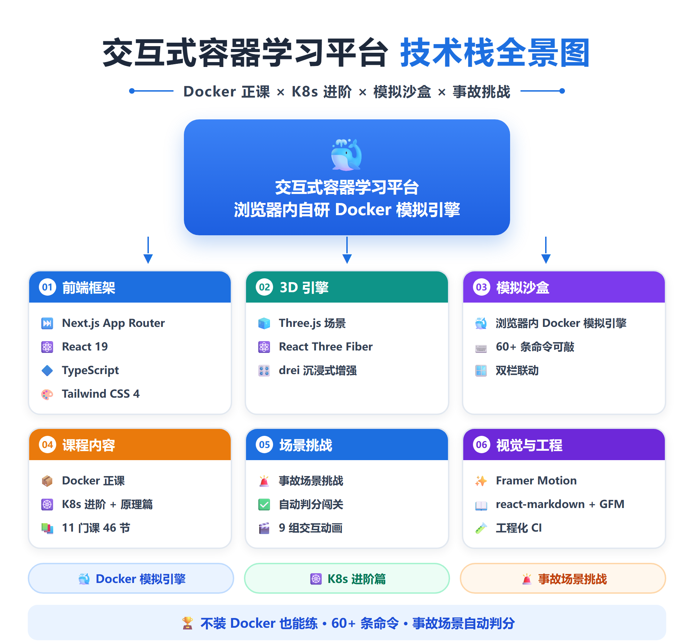
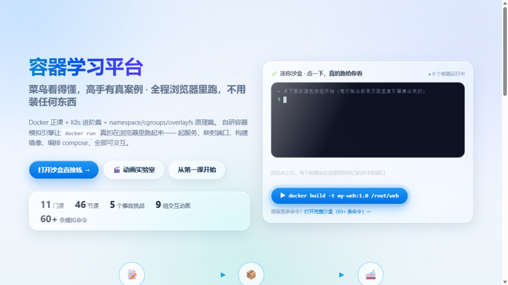
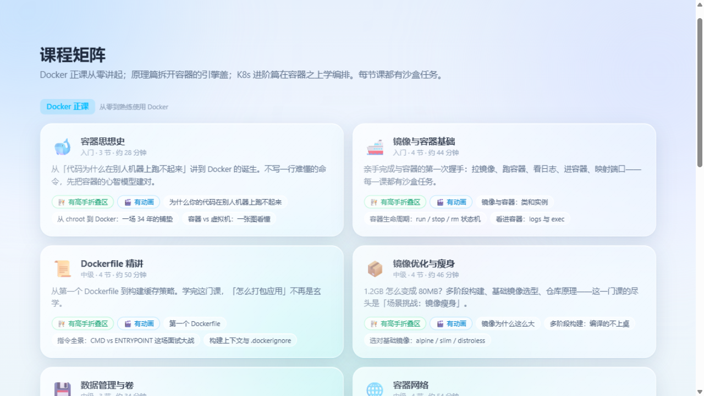
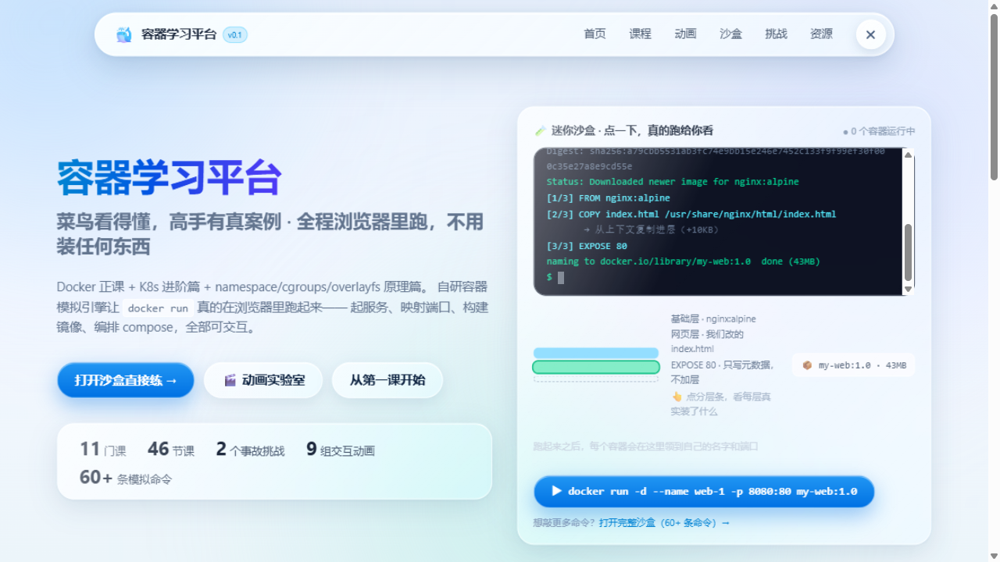
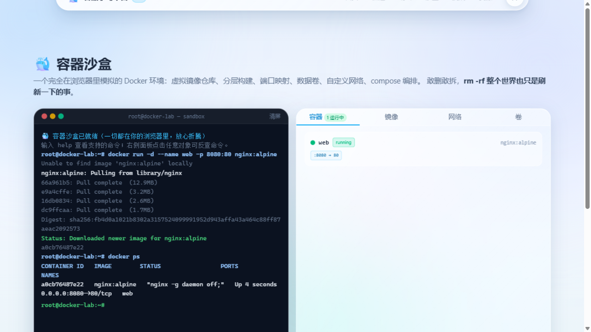
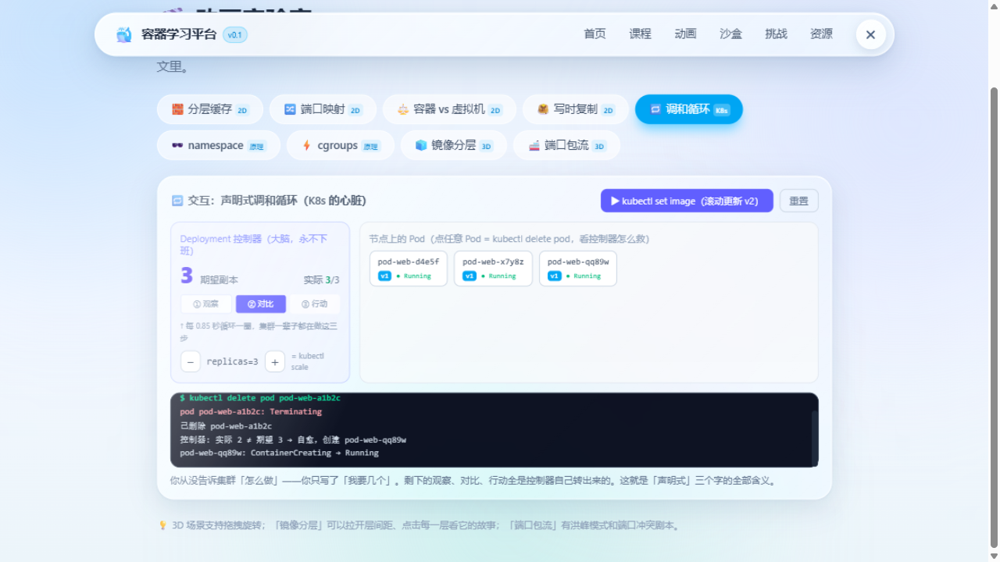
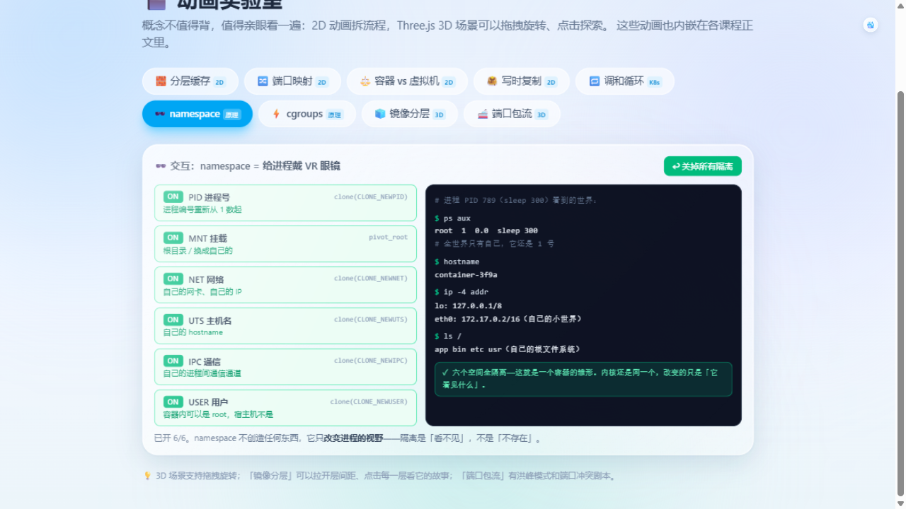

<p align="center">
  <h1 align="center">🐳 容器学习平台</h1>
  <p align="center">开源的交互式容器中文学习网站 · Docker 正课 + K8s 进阶 + 原理篇 · 浏览器内自研 Docker 模拟引擎 · 双栏联动沙盒 · 事故场景挑战</p>
</p>



一个**完全在浏览器中运行**的容器学习平台：11 门课 46 节、9 组可交互动画、可敲 60+ 条命令的模拟沙盒、10 道自动判分的场景挑战。不需要安装 Docker、不需要任何后端，打开网页就能练。

> 学习五重奏的第五件：[python-learning](https://gitee.com/starry-sea-1412/python-learning) · [git-learning-platform](https://gitee.com/starry-sea-1412/git-learning-platform) · [linux-learning-platform](https://gitee.com/starry-sea-1412/linux-learning-platform) · [photography-learning](https://gitee.com/starry-sea-1412/photography-learning)

> 技术栈：Next.js 16 (App Router) · React 19 · TypeScript · Tailwind CSS 4 · Framer Motion · Three.js

## 📸 界面截图

| 首页（迷你实操课） | 双栏联动沙盒 | 课程目录 |
|-------------------|-------------|----------|
|  |  |  |

## 📸 它长什么样

**首页 = 一堂 30 秒迷你实操课**：点一下按钮，终端里逐字敲出 `docker build`，每一行输出都由页面内的模拟引擎真实计算——构建日志、带名字的镜像分层（每层可点开看文件清单）、run 出的容器卡片可增可删：



**双栏联动沙盒**：左边敲真命令，右边容器/镜像/网络/卷实时长出来；点任何可视化对象，反查它对应的命令：



**声明式调和循环（K8s 的心脏）**：点任意 Pod = `kubectl delete pod`，看控制器如何发现「实际 2 ≠ 期望 3」并秒级自愈；扩缩容、滚动更新 v1→v2、事件流全程可读：



**namespace 视野切换器**：六层隔离逐个开关，进程看到的 `ps` / `hostname` / `ip addr` 随之实时改变——「隔离是看不见，不是不存在」：



## ✨ 产品原则

**菜鸟看得懂，高手有真案例**（低地板 + 高天花板）：

- **成体系**：Docker 正课 6 门 + K8s 进阶篇 3 门 + 原理篇 2 门，从「代码为什么在别人机器上跑不起来」一路讲到 `docker run` 按下之后的 12 件事；
- **交互最好**：所有动画可玩——删一个 Pod 看自愈、拉滑杆看 cgroups 限流与 OOM、点镜像分层看每层文件、六开关切 namespace 视野；
- **动画必须服务内容**：每帧动画都是命令/内核的真实行为，没有装饰性粒子；
- **本地可跑**：零后端、零依赖服务，`npm run dev` 即用，断网完整可用。

## 📚 课程全景（11 门 · 46 节）

| 轨道 | 课程 | 节数 |
|---|---|---|
| 🐋 Docker 正课 | 容器思想史 · 镜像与容器基础 · Dockerfile 精讲 · 镜像优化与瘦身 · 数据管理与卷 · 容器网络 | 20 |
| ☸️ K8s 进阶篇 | 为什么需要 Kubernetes · 核心对象与 kubectl · 调和循环实战（含 kind 真机毕业设计） | 10 |
| 🧬 原理篇 | 容器是怎么被造出来的（namespace/cgroups/徒手造容器）· 镜像与文件系统（overlayfs/OCI/全景 12 件事） | 8 |

每节课 = 正文叙事 + 内嵌交互动画 + 沙盒任务 + 🔵「高手折叠区」（生产事故复盘：PID 1 与优雅停机、日志撑爆磁盘、DNS 5 秒延迟、SNAT 端口耗尽、HPA 四坑、探针三兄弟……每条附真实出处）。

## 🖥️ 自研容器模拟引擎

`src/lib/container-sandbox-engine.ts`（纯 TypeScript，约 1300 行，无任何后端）：

- **虚拟镜像仓库**：nginx / redis / node / python / alpine 等 16 个常用镜像，体积与分层还原真实数据
- **容器生命周期**：run / ps / stop / kill（exit 137 剧本）/ pause / rm，端口冲突、名字冲突等真实报错
- **docker build 解释器**：Dockerfile 逐指令解析，支持多阶段构建、构建缓存（CACHED 标记）、COPY --from、**逐层文件账本**（每层记录新增/覆盖了哪些文件）
- **端口映射与 HTTP**：`-p 8080:80` 后 `curl localhost:8080` 真的能通，返回的是构建时 COPY 进去的真实页面，并留下 access log
- **数据卷与 bind mount**：named volume 生命周期、in-use 保护、bind mount 实时生效
- **自定义网络与 DNS**：默认 bridge 无 DNS（真实行为！）、自定义网络容器名互访
- **compose 编排**：内置极简 YAML 解析器，`docker compose up/down` 全流程
- **终端体验**：Tab 补全、命令历史、颜色输出、help 系统

## 🎬 交互动画（9 组）

| 动画 | 玩法 |
|---|---|
| 🧱 分层缓存 | 改一行代码重建，看 CACHED/REBUILT 的失效边界 |
| 🔀 端口映射 | curl 数据包飞行 + 端口冲突剧本 |
| ⚖️ 容器 vs 虚拟机 | 切换对比两套栈的重量 |
| 🥞 写时复制 | 在容器里改文件，看 CoW 复制到可写层 |
| 🔁 调和循环 | 删 Pod 看自愈、scale 扩缩、一键滚动更新 |
| 🕶️ namespace | 六开关切换进程的世界观 |
| ⚡ cgroups | 三滑杆体验限流 vs OOM 两种命运 |
| 🧊 镜像分层 3D | Three.js 拉开层间距、点击每层看故事 |
| 🚢 端口包流 3D | Three.js 包流洪峰与冲突 |

全部动画可在 `/demos` 动画实验室集中体验，也内嵌在相关课程正文里。

## 🚨 场景挑战

带剧情的实战演练（共 10 道）：初始故障现场 + 逐条验证目标 + 分层提示 + 参考解法，全部在浏览器沙盒里自动判分：

- **镜像瘦身** / **CI 慢如牛**——多阶段构建与构建缓存层序
- **凌晨 3 点容器秒退** / **重启风暴**——docker logs 排障、restart policy 的边界
- **微服务互相找不到** / **端口被占**——自定义网络 DNS、端口占用排查
- **用户文件去哪了** / **磁盘被日志写爆**——数据卷与 --log-opt 日志轮转
- **一条命令起一整套**——compose 编排与声明式改配置
- **exit 137**——cgroup 内存限额与 OOM Killer

## 🚀 快速开始

```bash
git clone https://gitee.com/starry-sea-1412/container-learning-platform.git
cd container-learning-platform
npm install
npm run dev
```

打开 [http://localhost:3000](http://localhost:3000) 即可使用。生产构建：`npm run build && npm start`。

## 📁 项目结构

```
src/
├── app/                    # 页面路由（App Router）
│   ├── courses/            # 课程列表
│   ├── course/[slug]/      # 课程阅读页（高手折叠区、动画、沙盒任务）
│   ├── sandbox/            # 双栏联动沙盒
│   ├── challenges/         # 场景挑战（自动判分）
│   ├── demos/              # 动画实验室（9 组动画集中体验）
│   └── resources/          # 精选资源导航
├── components/container/   # 终端、可视化面板、交互动画、Hero 迷你沙盒
├── data/                   # 课程 / 挑战 / 资源 全部为声明式数据
│   └── courses.ts          # 课程内容（46 节已全部上线）
├── lib/container-sandbox-engine.ts  # 自研 Docker 模拟引擎
└── types/                  # 领域类型定义
```

课程内容完全数据驱动——新增课程只需在 `src/data/courses.ts` 添加条目，新增动画在 `components/container/demos.tsx` 实现并在注册表挂一个 key。

## 🤝 致谢与参考

设计调研中对标的优秀项目：[dive](https://github.com/wagoodman/dive)（逐层镜像分析）、[Play with Docker](https://github.com/play-with-docker/play-with-docker)、[killercoda](https://killercoda.com/)、[iximiuz Labs](https://labs.iximiuz.com/)。本课程的毕业设计引导使用 [kind](https://kind.sigs.k8s.io/) 走向真机。

## 📄 许可证

[MIT](LICENSE)
